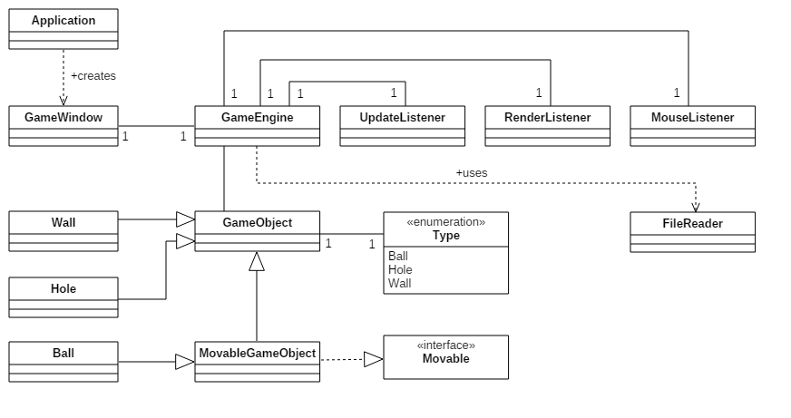
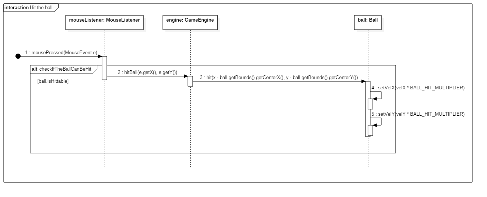
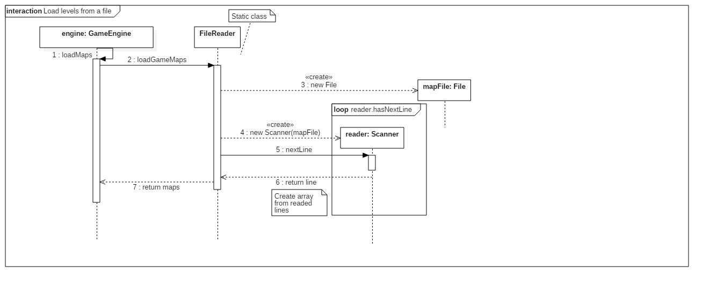

## Topic and structure

**Topic:** 2D Minigolf game

Topic of this project is to create a 2D minigolf game, which has multiple levels. Game will be created using only native Java components without any additional game libraries. Game levels will be saved as a text files and they will have a special format.

Possible extra feature will be a tiled map/level editor, so users can create their own levels and share them with other users. Levels will be saved to the text files using special format, so it will be easy to share them with others. 

**Users:** Common user (player)

**User actions:**
* Play the game
  * Choose and play different levels
  * Hit the ball
  * Try to beat the level
* Build new levels to the game
* Save new levels to a file
* Load levels from a file

## Structure
The Java main method begins in the Application class. In that class a new GameWindow is created. GameWindow is basically the core of ui (JFrame). In the GameWindow, a new GameEngine is created and added to the GameWindow. GameEngine is the core of the game. GameEngine combines the ui and the logic, it holds all the gameobjects instances and it has the timers for updating and rendering. Gameobject is an abstract class of object that can bee seen in the game. It holds all the position data and information how the object should be rendered. MovableGameObejct is a gameobject that has an movable interface, which means that in addition to render method it also has update method for moving.

Type enum is used for GameObject so that in GameEngine there is only abstarct GameObjects. GameEngine uses UpdateListener, RenderListener and MouseListener. UpdateListener is used for UpdateTimer and it controls the all the movable objects (only ball at this stage). RenderListener is used for RenderTimer and it handles all the rendering callbacks of items and drawing the screen. MouseListener is used for ball to calculate the direction where the ball should go.

## Class diagram

## Sequence diagrams

### Hit the ball

### Loading levels from a file
